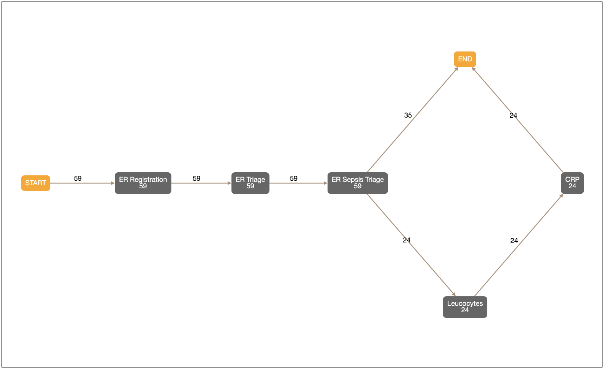

# ntnu-process-mining

Enabling the use of event logs to create rich interactive process and event-flow visualisations in jupyter notebooks with a few lines of code.

## Installation

To install use pip:

    $ pip install ntnu_process_mining

To install for jupyterlab

    $ jupyter labextension install ntnu_process_mining

## Usage

The library contains three different visualizations:

- Process Map
- Trace Explorer
- Trace Comparison (Work in Progress)

### Process Map

The Process Map visualization is inspired by [bupaR Process Maps](https://www.bupar.net/processmaps.html). It tries to display the event data in a graph. There are also filtering options to display only a subset of data. See `notebooks/process_map.py.ipynb` for usage.

### Trace Explorer

The Trace Explorer widget lets the user inspect specific traces. The widget displays all of the events, as seen in the screenshot below. The traces are clickable and filterable. See `notebooks/trace_explorer.py.ipynb` for usage.

### Trace Comparison

The Trace Comparison widget is a Work in Progress. It lets the user input a trace, and then tries output the most similar traces in the data set. See `notebooks/trace_comparison.py.ipynb` for usage.

## Development

For a development installation (requires npm),

    $ git clone https://github.com/navikt/ntnu-process-mining.git
    $ cd ntnu-process-mining
    $ pip install -e .
    $ jupyter nbextension install --py --symlink --sys-prefix ntnu_process_mining
    $ jupyter nbextension enable --py --sys-prefix ntnu_process_mining

See `js/README.md` for more information on how to enable fast local development.
